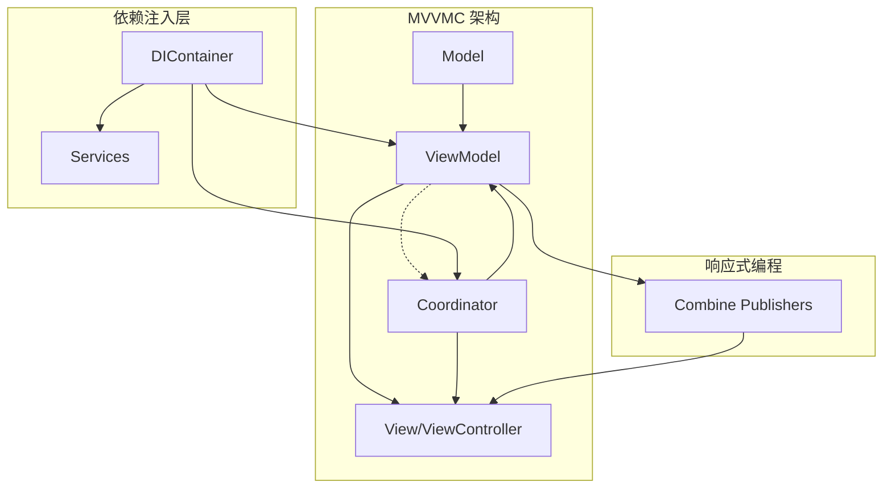

# iOSPluginDemo

一个基于 **MVVMC + Swinject + Combine** 架构的现代 iOS 应用示例项目，展示了模块化、可扩展、可维护的 iOS 开发最佳实践。

## 🏗️ 项目架构

### 核心架构模式：MVVMC

本项目采用 **MVVMC (Model-View-ViewModel-Coordinator)** 架构模式：

- **Model**: 数据模型和业务逻辑
- **View**: UIViewController 和 UI 组件
- **ViewModel**: 视图状态管理和业务逻辑处理
- **Coordinator**: 导航控制和模块间通信



## 🔧 技术栈

### 核心框架
- **Swift 5.0+** - 编程语言
- **iOS 15.0+** - 最低支持版本
- **Combine** - 响应式编程框架
- **Swinject** - 依赖注入容器
- **SwiftyBeaver** - 日志框架
- **Anchorage** - Auto Layout 库
- **Moya** - 网络请求框架

### 开发工具
- **Xcode 14.0+**
- **CocoaPods 1.12.0+**

## 🚀 快速开始

### 1. 克隆项目
```bash
git clone <repository-url>
cd iOSPluginDemo
```

### 2. 安装依赖
```bash
pod install
```

### 3. 打开项目
```bash
open iOSPluginDemo.xcworkspace
```

### 4. 运行项目
在 Xcode 中选择目标设备或模拟器，点击 Run 按钮或使用快捷键 `Cmd + R`。

## 📱 功能模块

### 主要功能
- 🔐 **用户认证** - 登录、注册、忘记密码
- 🏠 **首页展示** - 主要内容展示和详情页面
- 👤 **个人资料** - 用户信息管理
- ⚙️ **设置模块** - 应用配置和偏好设置

### 模块架构
```
iOSPluginDemo/
├── Auth/           # 认证模块
├── Home/           # 首页模块
├── Profile/        # 个人资料模块
├── Settings/       # 设置模块
├── Main/           # 主协调器
└── Core/           # 核心组件
    ├── DIContainer.swift       # 依赖注入容器
    ├── Logger.swift           # 日志系统
    ├── ViewModelable.swift    # ViewModel 基础协议
    ├── Coordinator.swift      # 协调器基础协议
    └── AuthStateManager.swift # 认证状态管理
```

## 🔄 依赖注入系统

本项目实现了增强的依赖注入系统，提供安全的依赖解析和详细的错误调试信息。

### 核心特性

#### 1. 安全依赖解析
```swift
// 安全解析 - 失败时返回 nil
if let authService = resolver.safeResolve(AuthServiceProtocol.self) {
    // 使用 authService
} else {
    // 处理依赖缺失情况
}

// 强制解析 - 失败时崩溃并提供详细错误信息
let authService = resolver.requiredResolve(AuthServiceProtocol.self)
```

#### 2. 详细错误调试
- 自动记录文件位置、行号和函数名
- 列出当前已注册的服务
- 提供清晰的错误信息和调试建议

#### 3. 依赖注册示例
```swift
// 在 DIContainer.swift 中
container.register(AuthServiceProtocol.self) { resolver in
    guard let authStateManager = resolver.safeResolve(AuthStateManager.self) else {
        AppLogger.fatal("AuthStateManager not registered - Auth module initialization failed")
        fatalError("AuthStateManager not registered")
    }
    return AuthService(authStateManager: authStateManager)
}.inObjectScope(.container)
```

## 📝 日志系统

项目实现了统一的日志抽象层，避免直接调用 SwiftyBeaver 方法。

### 使用方式

#### 1. 在类中使用 (通过 Loggable 协议)
```swift
class ExampleViewModel: ViewModelable {
    func someMethod() {
        log.info("这是一条信息日志")
        log.warning("这是一条警告日志")
        log.error("这是一条错误日志")
    }
}
```

#### 2. 全局静态日志
```swift
AppLogger.info("应用启动")
AppLogger.error("发生错误: \(error)")
```

#### 3. 特定上下文日志
```swift
AppLogger.auth("用户登录成功")
AppLogger.di("依赖注入容器初始化")
AppLogger.network("网络请求完成")
AppLogger.ui("界面更新")
```

### 日志级别
- 🔍 **Debug** - 调试信息
- ℹ️ **Info** - 一般信息
- ⚠️ **Warning** - 警告信息
- ❌ **Error** - 错误信息
- 💀 **Fatal** - 致命错误

## 🔄 响应式编程

项目使用 Combine 框架实现响应式编程，避免使用 NotificationCenter。

### 认证状态管理示例
```swift
class AuthStateManager {
    @Published private(set) var currentUser: User?
    @Published private(set) var isLoggedIn: Bool = false
    
    private let authEventSubject = PassthroughSubject<AuthEvent, Never>()
    var authEventPublisher: AnyPublisher<AuthEvent, Never> {
        authEventSubject.eraseToAnyPublisher()
    }
    
    func login(user: User) {
        currentUser = user
        isLoggedIn = true
        authEventSubject.send(.loginSuccess(user))
    }
}
```

### ViewModel 中的使用
```swift
class AuthViewModel: ViewModelable {
    @Published var isLoading = false
    @Published var errorMessage: String?
    
    private func setupBindings() {
        authStateManager.$isLoggedIn
            .receive(on: DispatchQueue.main)
            .sink { [weak self] isLoggedIn in
                // 处理登录状态变化
            }
            .store(in: &cancellables)
    }
}
```

## 🎯 协调器模式

使用协调器模式管理导航流程和模块间通信。

### 协调器层次结构
```
MainCoordinator (根协调器)
├── AuthCoordinator    # 认证流程
├── HomeCoordinator    # 主页导航
├── ProfileCoordinator # 个人资料
└── SettingsCoordinator # 设置页面
```

### 生命周期管理
- 使用 `CoordinatorRegistry` 单例模式管理协调器实例
- 实现弱引用管理机制避免内存泄漏
- 统一的协调器生命周期追踪

## 🧪 最佳实践

### 1. 代码规范
- **协议导向设计** - 优先使用协议而非继承
- **依赖注入** - 所有依赖通过构造函数注入
- **响应式编程** - 使用 Combine 替代通知和回调
- **模块化** - 清晰的模块边界和职责分离

### 2. 架构原则
- **单一职责** - 每个类和模块只负责一项职责
- **依赖倒置** - 依赖抽象而非具体实现
- **开闭原则** - 对扩展开放，对修改封闭
- **接口隔离** - 使用小而专用的协议

### 3. 测试策略
- **依赖注入** - 便于模拟和单元测试
- **协议抽象** - 可测试的组件设计
- **响应式编程** - 可预测的状态管理

## 📚 项目结构详解

### Core 模块
- `DIContainer.swift` - 依赖注入容器和安全解析
- `Logger.swift` - 统一日志系统
- `AuthStateManager.swift` - 认证状态管理
- `Coordinator.swift` - 协调器基础协议
- `ViewModelable.swift` - ViewModel 基础协议
- `ViewControllable.swift` - ViewController 基础协议

### 业务模块
每个业务模块包含：
- `*Module.swift` - 模块定义和依赖注册
- `*Coordinator.swift` - 模块导航协调器
- `*ViewModel.swift` - 视图模型
- `*ViewController.swift` - 视图控制器
- `*Service.swift` - 业务服务（如需要）

## 🔍 调试和问题排查

### 1. 依赖注入问题
如果遇到依赖解析失败：
1. 检查服务是否在 `DIContainer.swift` 中正确注册
2. 查看控制台的详细错误信息和已注册服务列表
3. 确认依赖链没有循环引用

### 2. 导航问题
如果协调器导航不正常：
1. 检查协调器的生命周期管理
2. 确认协调器之间的引用关系
3. 查看 `CoordinatorRegistry` 中的协调器状态

### 3. 状态管理问题
如果状态更新不及时：
1. 确认使用了 `@Published` 属性包装器
2. 检查订阅是否在正确的队列上执行
3. 验证 `cancellables` 的生命周期管理

## 🤝 贡献指南

1. Fork 项目
2. 创建特性分支 (`git checkout -b feature/AmazingFeature`)
3. 提交更改 (`git commit -m 'Add some AmazingFeature'`)
4. 推送到分支 (`git push origin feature/AmazingFeature`)
5. 开启 Pull Request

## 📄 许可证

本项目采用 MIT 许可证 - 查看 [LICENSE](LICENSE) 文件了解详情。

## 📞 联系信息

如有问题或建议，请通过以下方式联系：
- 创建 Issue
- 发送 Pull Request
- 项目维护者邮箱

---

> **注意**: 这是一个示例项目，用于展示 iOS 开发的最佳实践和架构模式。在生产环境中使用时，请根据具体需求进行调整和优化。